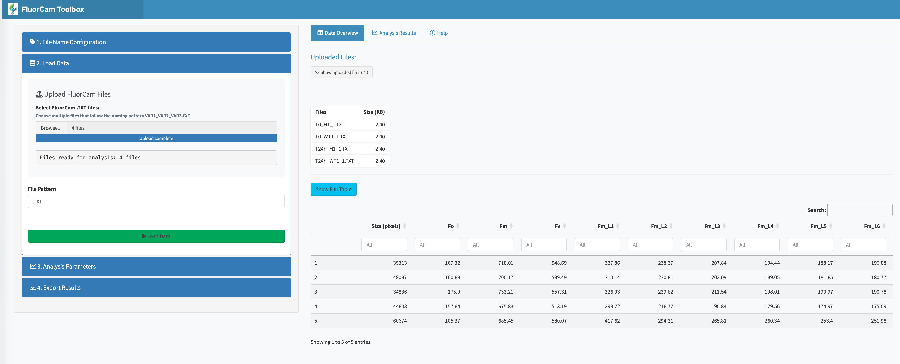
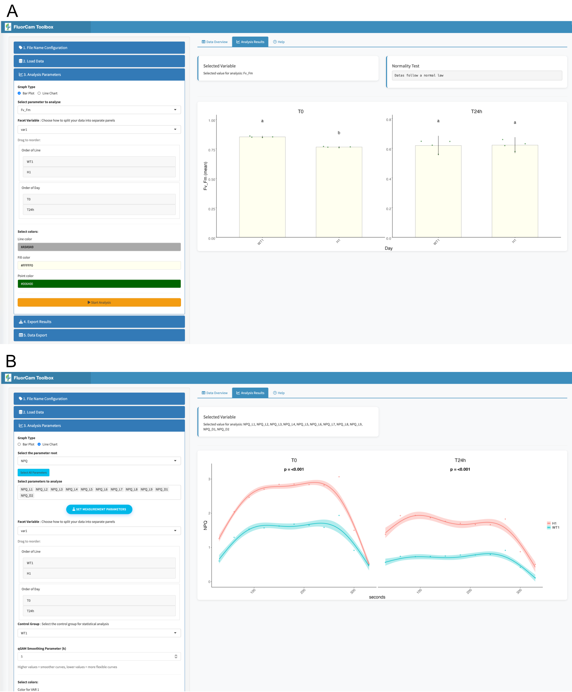

# Summary

FluorCam Toolbox is an open-source R Shiny [@chang2024] application designed to streamline chlorophyll fluorescence data analysis from PSI FluorCam systems.
The application provides an intuitive web interface that guides users through data processing, statistical analysis, and visualization without requiring programming expertise.
Key features include automated statistical testing, advanced time-course modeling using quantile GAMs [@fasiolo2021], and publication-ready visualizations with statistical annotations.

# Statement of Need

Chlorophyll fluorescence analysis is essential for assessing photosynthetic performance and plant stress responses [@romand2022], with modern FluorCam systems generating over 50 parameters per measurement.
However, current analysis workflows face significant challenges: manual processing in spreadsheets is error-prone and time-consuming, while R script automation remains inaccessible to researchers without programming skills.
Existing solutions lack integration between data processing, statistical analysis, and visualization.

FluorCam Toolbox addresses this gap by providing a user-friendly platform that democratizes access to sophisticated fluorescence analysis while maintaining statistical rigor and reproducibility.
The tool serves plant biologists, ecophysiologists, and agricultural researchers using chlorophyll fluorescence for stress assessment, climate research, and crop improvement.

# Key Features

**Automated Data Processing**: Native support for FluorCam .TXT files with batch processing, automatic parameter calculation (Fv/Fm, NPQ), and systematic file naming validation (\@ref(fig:FluorCamToolbox_gui)).

{#fig:FluorCamToolbox_gui}
On the left, the accordion for analysis parameter is open showing the customizing options. In the main panel the first line of the assembled data are shown.

**Robust Statistical Analysis**: Automatic normality testing is used to decide whether the data meet the assumptions required for parametric analysis.
When they do, the software applies ANOVA (Analysis of Variance) followed by Tukey’s HSD (Honestly Significant Difference) test to identify which groups differ significantly.
When the data are not normally distributed, it instead performs the non-parametric Kruskal–Wallis test with Dunn’s post-hoc comparisons.
For time-course data, the software employs quantile Generalized Additive Models (qGAMs), which provide flexible curve fitting while remaining robust to outliers and non-uniform variance.

**Publication-Ready Visualization**: Dynamic plots with statistical annotations [@graves2024], customizable themes (\@ref(fig:visualization_panel)), and multi-format export (PNG, PDF, SVG).
The interface adapts to data structure with guided workflow and progressive disclosure.

{#fig:visualization_panel}
Both Bar plot (A) and Line Chart (B) are shown with statistical annotations.

**Multi-User Deployment**: Session isolation with automatic cleanup, file validation, and security features enable safe server deployment for institutional use.

# Implementation

The modular architecture separates concerns across ui.R (interface), server.R (logic), helpers.R (analysis functions),
and global.R (configuration). CRAN-only dependencies ensure cross-platform stability while comprehensive error handling provides
reliable failure recovery with clear user feedback.

# Development prospects

Future versions will include additional options, such as the ability to modify the color of each bar in a barplot independently,
and to represent measurements collected over multiple days as a curve. The application will also be extended to integrate mesurement tools from 
other providers by supporting additional file formats.

# Acknowledgments

Work was supported by the Agence Nationale de la Recherche (ANR-17-CE13-0005, ANR-22-CE20-0033)

# References
