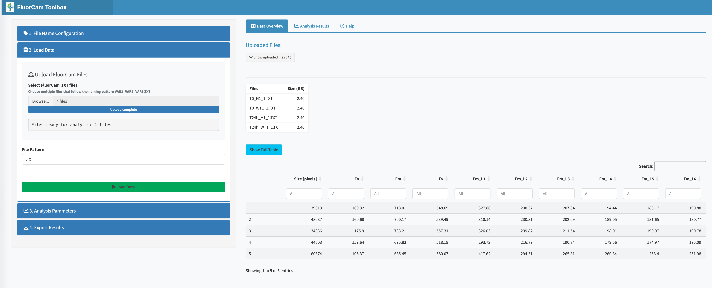
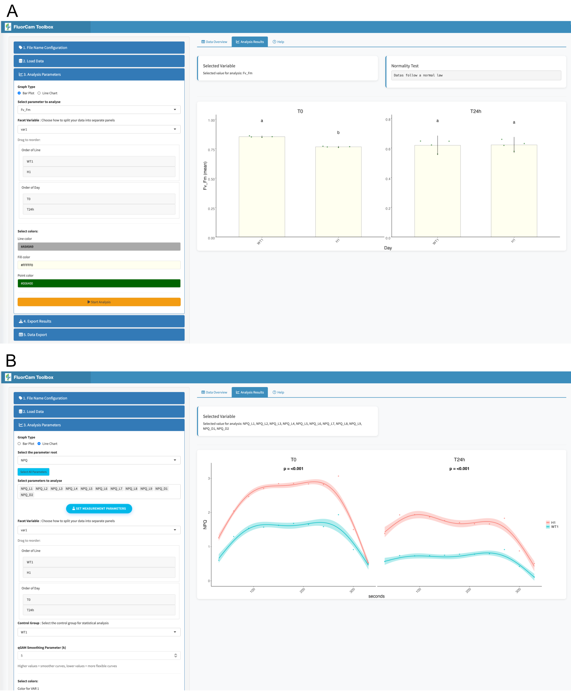

# Summary

FluorCam Toolbox is an open-source R Shiny [@chang2024] application designed to streamline chlorophyll fluorescence data analysis from PSI FluorCam systems.
The application provides an intuitive web interface that guides users through data processing, statistical analysis, and visualization without requiring programming expertise.
Key features include automated statistical testing, advanced time-course modeling using quantile GAMs [@fasiolo2021], and publication-ready visualizations with statistical annotations.

# Statement of Need

Chlorophyll fluorescence analysis is essential for assessing photosynthetic performance and plant stress responses [@romand2022], with modern FluorCam systems generating over 50 parameters per measurement.
However, current analysis workflows face significant challenges: manual processing in spreadsheets is error-prone and time-consuming, while R script automation remains inaccessible to researchers without programming skills.
Existing solutions lack integration between data processing, statistical analysis, and visualization.

FluorCam Toolbox addresses this gap by providing a user-friendly platform that democratizes access to sophisticated fluorescence analysis while maintaining statistical rigor and reproducibility.
The tool serves plant biologists, ecophysiologists, and agricultural researchers using chlorophyll fluorescence for stress assessment, climate research, and crop improvement.

# State of Field

In the field of plant phenotyping with FluorCam systems, data extraction, processing, and visualization workflows remain highly fragmented. Most researchers rely on ad hoc scripts or manual data handling in spreadsheet software such as Microsoft Excel, which is time-consuming and prone to human error. Statistical analyses are often performed within the same tool or exported to external statistical environments (e.g., R or Python), requiring repeated data reformatting and further increasing the risk of inconsistency. Although some laboratories have developed in-house scripts for partial automation, these tools are rarely shared, lack documentation, and are not interoperable across projects. No existing package currently provides an end-to-end integration for FluorCam data, from import to advanced statistical and graphical analyses. Contributing to scattered repositories would not have resulted in a coherent or sustainable solution. Instead, we developed a standalone, open-source Shiny application that unifies data management, visualization, and analysis within a user-friendly web interface. This integrated approach democratizes access to advanced analytical methods and improves reproducibility across research teams using FluorCam systems.

# Software Design

The creation of FluorCam Toolbox stemmed from the need to empower plant biologists with high-quality chlorophyll fluorescence analysis, free from the barriers of complex scripting languages, cryptic error messages, and manual spreadsheet processing that hinder result interpretation. 

Key trade-offs prioritized user-friendliness and robustness over maximal flexibility. A modular architecture employs reactive programming principles, using ReactiveValues for shared mutable storage to enable efficient updates alongside comprehensive validation pipelines that prevent invalid analyses. The accordion layout enforces a logical workflow, from file configuration and data loading to analysis and export, while reducing visual clutter. Conditional UI elements and dynamic dropdowns populated from actual data columns further adapt to diverse FluorCam configurations without overwhelming users.

# Research Impact Statement

FluorCam Toolbox was initially developed to meet the analysis needs of plant biology researchers in our laboratory, where it has been enthusiastically adopted as the primary tool for chlorophyll fluorescence data processing. Early users provided valuable feedback that directly informed iterative improvements, and the tool is now expanding its reach with adoption by collaborators at Uppsala University (Sweden) and the University of Bristol (UK), signaling growing external use beyond our institution.

Tailored for widely used PSI FluorCam systems, which lack any manufacturer-provided analysis software, the toolbox fills a critical gap for the plant biology community by integrating seamless data processing, advanced statistics, and customizable plots. 

Comprehensive documentation, CRAN-only dependencies, session isolation for multi-user deployment, and an open-source license under preparation ensure community readiness. Future releases and contributions via GitHub will support reproducible photosynthesis research at scale.

Laboratory colleagues, as first adopters, now routinely use the toolbox for PSI FluorCam data, replacing error-prone manual spreadsheets and inaccessible R scripts. 

# AI Usage Disclosure

AI-based tools were used to assist with English language editing to improve clarity and readability. An AI-based tool (Github Copilot) was also used to support an iterative process of code development, including suggestions for syntax, structure, and debugging. The software design, implementation choices, analyses, and validation were carried out by the authors. All text and code were reviewed, tested, and validated by the authors, who take full responsibility for the work.

# Key Features

**Automated Data Processing**: Native support for FluorCam .TXT files with batch processing, automatic parameter calculation (Fv/Fm, NPQ), and systematic file naming validation (figure 1).

Figure 1: Screen shot of FluorCam Toolbox user interface.  
On the left, the accordion for analysis parameter is open showing the customizing options. In the main panel the first line of the assembled data are shown.  

**Robust Statistical Analysis**: Automatic normality testing is used to decide whether the data meet the assumptions required for parametric analysis.
When they do, the software applies ANOVA (Analysis of Variance) followed by Tukey’s HSD (Honestly Significant Difference) test to identify which groups differ significantly.
When the data are not normally distributed, it instead performs the non-parametric Kruskal–Wallis test with Dunn’s post-hoc comparisons.
For time-course data, the software employs quantile Generalized Additive Models (qGAMs), which provide flexible curve fitting while remaining robust to outliers and non-uniform variance.

**Publication-Ready Visualization**: Dynamic plots with statistical annotations [@graves2024], customizable themes (figure 2), and multi-format export (PNG, PDF, SVG).
The interface adapts to data structure with guided workflow and progressive disclosure.

Figure 2: Screen shot of FluorCam Toolbox visualization panel.  
Both Bar plot (A) and Line Chart (B) are shown with statistical annotations.  

**Multi-User Deployment**: Session isolation with automatic cleanup, file validation, and security features enable safe server deployment for institutional use.

# Implementation

The modular architecture separates concerns across ui.R (interface), server.R (logic), helpers.R (analysis functions),
and global.R (configuration). CRAN-only dependencies ensure cross-platform stability while comprehensive error handling provides
reliable failure recovery with clear user feedback.

# Development prospects

Future versions will include additional options, such as the ability to modify the color of each bar in a barplot independently,
and to represent measurements collected over multiple days as a curve. The application will also be extended to integrate mesurement tools from 
other providers by supporting additional file formats.

# Acknowledgments

Work was supported by the Agence Nationale de la Recherche (ANR-17-CE13-0005, ANR-22-CE20-0033)

# References
